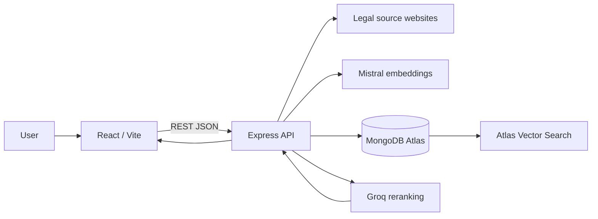
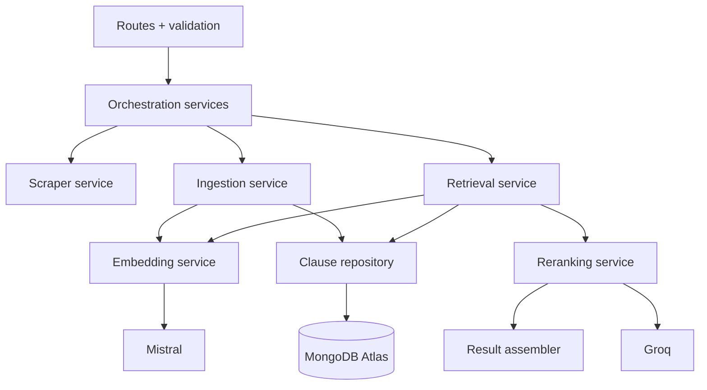
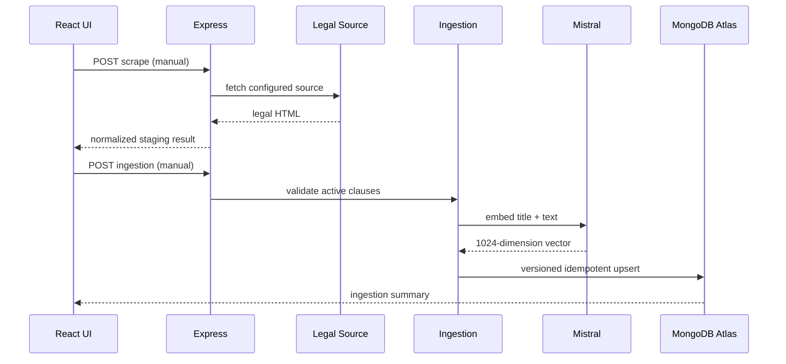
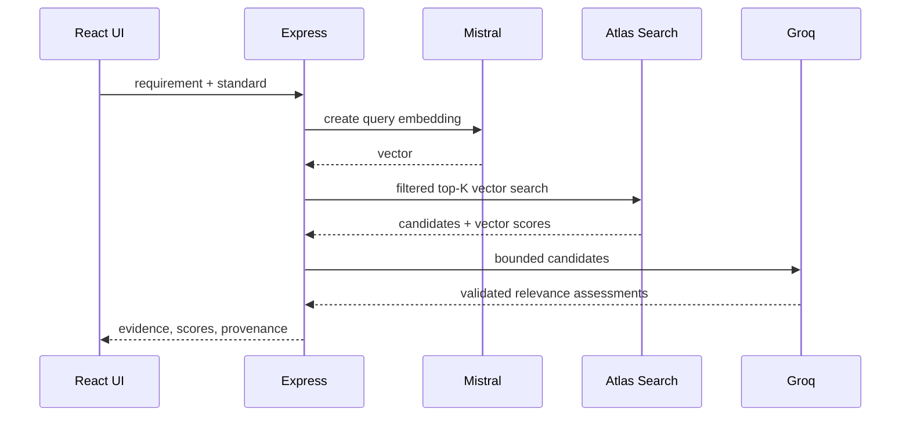
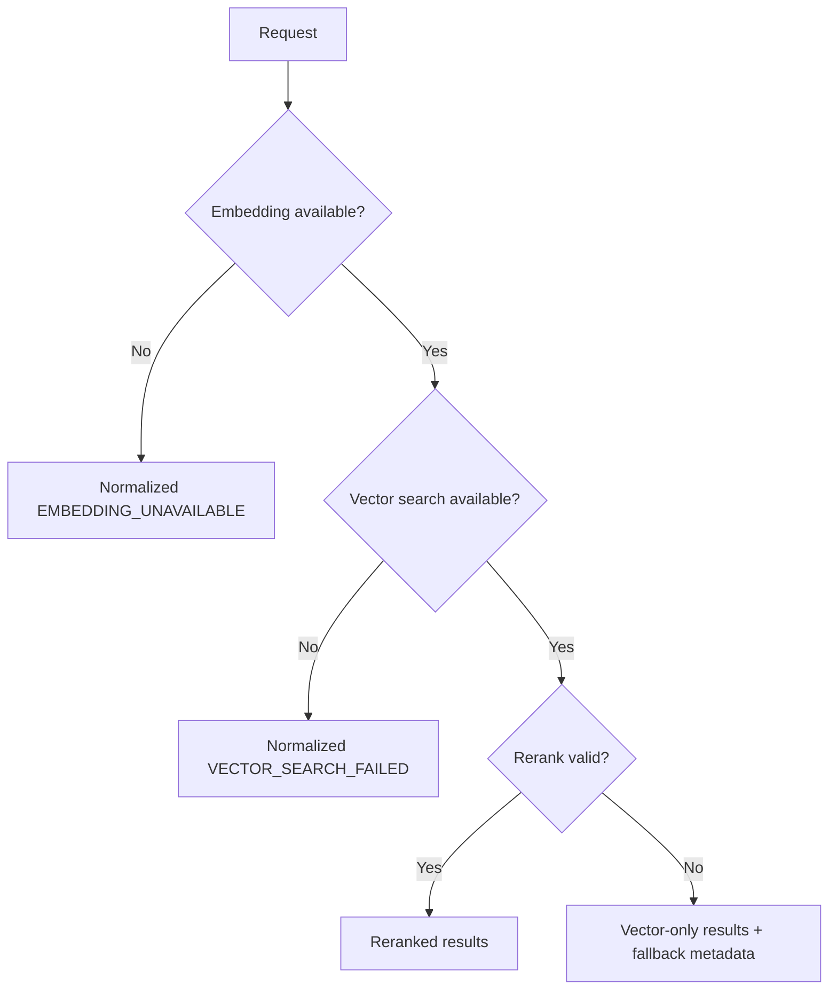

# Compliance Coverage Agent — Architecture

## 1. Purpose

Map a product requirement to traceable GDPR or EU AI Act obligations. The system retrieves legal clauses deterministically with embeddings and MongoDB Atlas Vector Search, then optionally reranks them with Groq. It is a research and coverage-support tool, not legal advice or an autonomous compliance decision-maker.

## 2. Scope

In scope: manual legal-source scraping, manual ingestion, GDPR and EU AI Act retrieval, versioned clause storage, evidence-rich results, score transparency, and a single-page React experience. Out of scope: authentication, scheduled jobs, microservices, Kafka, Redis, Kubernetes, GraphQL, additional regulations, fine-tuning, browser automation, and autonomous agents.

## 3. Architecture Decisions

| Decision | Selected design |
| --- | --- |
| Workflow/UI | A single page combines manual scrape, manual ingest, and retrieval for all users. The logical scrape and ingest operations remain independent API operations. |
| Regulations | API supports GDPR, EU AI Act, or both; the UI requires separate GDPR and EU AI Act retrieval runs rather than a merged cross-regulation view. |
| Retrieval API | Unified `POST /api/v1/compliance/retrieve`. |
| Versioning | URL versioning: `/api/v1`. |
| Vector controls | Configured server defaults with bounded, validated request overrides. |
| Reranking | Rerank a configured subset; on Groq failure return vector-ranked results with explicit provenance. |
| Result evidence | Return clause identity, excerpt, canonical source URL, vector/reranking/final scores, explanation, and separate evidence for every referenced clause. |
| Coverage | Return an indicative, documented coverage score. |
| Source lifecycle | Scraping and ingestion are both manual. |
| Clause updates | Version history: prior version becomes inactive; new active version is retained. |
| Failures | Safe fallback where evidence remains valid; otherwise normalized error. |
| Audit | Structured, request-level logs without secrets or full sensitive requirement text. |
| Theme | Light, dark, and system themes. |

## 4. Technology Stack

Frontend: React 19, TypeScript, Vite, native Fetch, REST/JSON. Backend: Node.js, TypeScript, Express. Scraping: LangChain, CheerioWebBaseLoader, Cheerio. Embeddings: Mistral `mistral-embed` through LangChain, 1024 dimensions. Data: MongoDB Node.js Driver and MongoDB Atlas Vector Search using cosine similarity. Reranking: Groq via LangChain ChatGroq.

## 5. System Context

### System Architecture



The browser never calls Mistral, Groq, or MongoDB and never receives their credentials.

## 6. High-Level Architecture

The API owns orchestration. A scraper normalizes legal sources to clauses. An ingestion service embeds and upserts versioned clauses. A retrieval service embeds a requirement and retrieves candidates. A reranking service receives candidates only; it never queries MongoDB. A result assembler validates scores, preserves source evidence, and applies the documented coverage formula.

## 7. Component Architecture

### Component Dependency Diagram



Routes must be thin. Provider-specific clients sit behind services so validation, fallback, and tests remain independent.

## 8. API Architecture

All production endpoints are rooted at `/api/v1`; legacy `/api/...` routes may be retained temporarily only as deprecated compatibility adapters. Use JSON, request-size limits, CORS allowlists, request IDs, input validation, and the envelopes below.

| Method | Path | Purpose |
| --- | --- | --- |
| GET | `/api/v1/health` | Liveness/readiness without secrets |
| POST | `/api/v1/legal-sources/{standard}/scrapes` | Manually scrape `gdpr` or `eu-ai-act` |
| POST | `/api/v1/legal-sources/{standard}/ingestions` | Manually ingest normalized clauses |
| POST | `/api/v1/compliance/retrieve` | Retrieve compliance evidence |

Successful responses use:

```json
{ "success": true, "data": {}, "meta": { "requestId": "uuid" } }
```

Errors use:

```json
{ "success": false, "error": { "code": "VECTOR_SEARCH_FAILED", "message": "Unable to retrieve compliance clauses", "requestId": "uuid" } }
```

## 9. API Contracts

`POST /api/v1/compliance/retrieve` accepts:

```json
{
  "requirement": "Users can request deletion of personal data.",
  "standards": ["GDPR"],
  "topK": 10,
  "similarityThreshold": 0.65
}
```

`requirement` is required non-empty text with a configured maximum length. `standards` is one or both of `GDPR`, `EU_AI_ACT`; the API supports both for future/API clients, while the UI sends one standard per run. `topK` and `similarityThreshold` are optional bounded overrides. Invalid input returns deterministic `400`/`422` errors.

Response `data` contains `results`, `coverage`, and `retrieval`. Every result contains `standard`, `clauseId`, `title`, `excerpt`, `sourceUrl`, `vectorScore`, `rerankingScore` (or `null`), `finalScore`, `explanation`, and `evidence`. `evidence` is an array of separately attributable clause references; each entry contains its own regulation, clause ID, canonical URL, and relevant online-source excerpt. Never combine citations into an unsupported synthetic source.

`retrieval` includes `embeddingModel`, `rerankingModel` when used, `rerankingApplied`, `resultSource` (`reranked` or `vector-search`), and optional `fallback` metadata. Scrape/ingestion responses report counts, source/version metadata, warnings, and request ID.

## 10. Domain Models

`LegalClause`: stable `standard`, `clauseId`, `title`, normalized `text`, `sourceUrl`, `contentHash`, `version`, `isActive`, timestamps, `metadata`, and `embedding`.

`RetrievalCandidate`: an active legal clause plus `vectorScore`.

`RerankAssessment`: `clauseId`, `relevanceScore` in `[0,1]`, and concise evidence-grounded `reason`.

`ComplianceResult`: candidate evidence plus optional rerank score, final score, explanation, and provenance.

## 11. Scraping Architecture

Manual scraping fetches only configured, approved official legal URLs via CheerioWebBaseLoader/Cheerio. Normalization extracts stable clause/article IDs, title, complete text, canonical source URL, source retrieval time, and content hash into JSON staging data. Validate source structure and reject malformed or unexpectedly sparse output. Scraping does not embed or modify Atlas. Log source URL/domain, counts, latency, and errors; do not log secrets.

### Scraping + Ingestion Sequence



## 12. Ingestion Architecture

Ingestion runs only after an explicit manual request against staged normalized data. Its natural key is `standard + clauseId`; compare `contentHash`. If unchanged, do not duplicate. If changed, mark the prior active version inactive and write the incremented active version. Preserve `createdAt` for a version and set `updatedAt` on changes. One ingestion batch must report partial failures clearly and never declare unembedded clauses searchable.

## 13. Embedding Architecture

Use the same configured Mistral model and preprocessing policy for clause and query embeddings. The configured dimension must be 1024 and validated at startup and before persistence. Query and document vectors must share the same compatible vector space. Any embedding model, dimension, or preprocessing change requires complete re-embedding/reindexing of active clauses before retrieval is enabled; changing only Groq does not.

## 14. MongoDB Data Model

Use separate logical GDPR and EU AI Act collections (configured names), with every document still carrying `metadata.standard`. A representative document is:

```json
{
  "standard": "GDPR", "clauseId": "Article 17", "title": "Right to erasure",
  "text": "...", "sourceUrl": "https://...", "contentHash": "sha256:...",
  "version": 2, "isActive": true, "embedding": [0.0],
  "metadata": { "standard": "GDPR", "clauseId": "Article 17" },
  "createdAt": "ISO-8601", "updatedAt": "ISO-8601"
}
```

Enforce a unique compound index on `(standard, clauseId, version)` and query only `isActive: true` for normal retrieval.

## 15. Atlas Vector Search Architecture

Each collection has a configured Atlas index with `embedding` vector field, 1024 dimensions, cosine similarity, and filters for `metadata.standard` and `metadata.clauseId`. Retrieval applies active-version and standard filters, requests a configured candidate pool, then applies the configured similarity threshold. Index dimensions and embedding configuration are a startup compatibility invariant.

## 16. Retrieval Pipeline

### Retrieval Sequence



Validate request, create query embedding, search active clauses deterministically, threshold candidates, pass only the configured maximum to reranking, validate structured output, assemble results, and return evidence. The LLM never replaces vector search as primary retrieval.

## 17. Reranking Pipeline

The trusted prompt defines evaluation rules. Requirement text and retrieved clause content are quoted/serialized as untrusted data and cannot override those rules. Groq must return strict structured data for every accepted clause: `clauseId`, `relevanceScore` `[0,1]`, and short `reason`. Reject unknown IDs, duplicates, malformed scores, and schema-invalid output. On a Groq transport, timeout, or validation failure, return vector-ranked candidates with `rerankingApplied: false`, `resultSource: "vector-search"`, and explicit fallback reason.

## 18. Compliance Scoring

Expose score components; do not silently combine them. With reranking, `finalScore = 0.35 × normalizedVectorScore + 0.65 × rerankingScore`. Without reranking, `finalScore = normalizedVectorScore` and the response identifies vector-only fallback. Sort descending by final score.

The indicative coverage score is `100 × min(1, sum(finalScore for distinct active clauseIds returned) / configuredCoverageTarget)`, rounded to a whole percentage. `configuredCoverageTarget` is an environment value (default documented by deployment). It signals retrieval coverage only, is not a legal determination, and must be presented with the supporting clause list.

## 19. Error Handling

Map validation problems to `400`/`422`, missing resources to `404`, conflict/idempotency violations to `409`, rate limits to `429`, and unavailable dependencies to `503` where appropriate. Use stable codes including `INVALID_REQUEST`, `SCRAPE_SOURCE_UNAVAILABLE`, `INGESTION_FAILED`, `EMBEDDING_UNAVAILABLE`, `VECTOR_SEARCH_FAILED`, `RERANKING_UNAVAILABLE`, and `RERANKING_OUTPUT_INVALID`. Never expose stack traces, credentials, internal prompts, database details, or keys.

## 20. Configuration Management

Validate environment configuration at process startup and fail fast for mandatory values. Operational values must not be hardcoded: port, Mongo URI/database, collection/index names, provider keys/models, dimensions, batch size, candidate count, Top-K bounds/default, threshold bounds/default, rerank count/threshold, coverage target, CORS origins, request-size limit, feature flags, and log level. Use separate development, test, and production configurations; production must not assume localhost, port 5001, or Vite.

## 21. Security

Keep all credentials server-side in environment variables or a deployment secret store. Restrict CORS to approved origins, cap request body size, validate and normalize input, use outbound allowlists for legal source URLs, apply rate limiting as a deployment concern, and return safe error messages. The absence of authentication is an explicit current constraint; do not imply that manual operations are authorization-protected until authentication is added.

## 22. Prompt Injection Protection

Treat user requirements and legal source content as untrusted data. The reranking system instruction is trusted and explicitly says never to follow instructions embedded in either input, to score only provided clause IDs, and to emit only the validated schema. Limit candidate text and field lengths, delimit content, and do not pass secrets, tools, or system configuration to the model.

## 23. Observability and Logging

Generate or accept a validated `requestId` for every request and propagate it through services, provider calls, logs, and responses. Emit structured logs with request ID, operation, selected standard, candidate/returned counts, embedding/vector/rerank/total latency, model names, `rerankingApplied`, fallback status, sanitized error code, and timestamp. Do not log API keys, Mongo URI, prompts, full provider responses, or full sensitive requirement text. Store auditable retrieval metadata and scores according to the deployment retention policy.

## 24. Frontend Architecture

Use a single React page composed of: operation controls (manual scrape and ingest), a requirement editor, regulation selector, retrieval controls, coverage summary, result list, and theme switcher. Frontend services call only the versioned REST API and share TypeScript API/domain types. The user chooses GDPR or EU AI Act for each UI retrieval; to examine both, they run and review two separate searches. The API’s multi-standard capability remains available for non-UI clients/future use.

## 25. UI/UX Flow

The page presents an ordered workflow: select legal source and run scrape, review status then run ingest, enter a requirement and choose a regulation, submit retrieval, review score/evidence cards, and open canonical URLs. Each card shows regulation, clause/article ID, title, relevant excerpt, source link, explanation, score breakdown, and whether it was reranked or vector-only. Operations display clear scope and destructive-effect warnings where relevant. Retrieval and operation buttons are disabled while their corresponding request runs.

## 26. State Management

Each independent API operation has `idle`, `loading`, `success`, `empty`, and `error` states. Maintain operation-specific request IDs and errors so scraping errors never overwrite retrieval results. Persist theme preference in `localStorage`; resolve system preference before paint to avoid flashing. Use CSS variables/design tokens and accessible contrast. Theme affects presentation only—not queries, models, scores, or API results.

## 27. Project Structure

```text
frontend/src/
  pages/ components/ services/ types/ styles/
backend/src/
  config/ routes/ middleware/ services/ scrapers/ ingestion/ retrieval/
  repositories/ schemas/ observability/
backend/data/                 # normalized staging files
backend/scripts/              # controlled operational scripts
postman/                      # API collection and environments
```

## 28. Environment Variables

Required examples: `PORT`, `MONGODB_URI`, `MONGODB_DATABASE`, `GDPR_COLLECTION`, `EU_AI_ACT_COLLECTION`, `GDPR_VECTOR_INDEX`, `EU_AI_ACT_VECTOR_INDEX`, `MISTRAL_API_KEY`, `MISTRAL_EMBED_MODEL`, `GROQ_API_KEY`, `GROQ_RERANK_MODEL`, `EMBEDDING_DIMENSIONS=1024`, and `VITE_API_BASE_URL` (frontend only). Configurable examples: `VECTOR_TOP_K_DEFAULT`, `VECTOR_TOP_K_MAX`, `VECTOR_SIMILARITY_THRESHOLD_DEFAULT`, `RERANK_CANDIDATE_COUNT`, `RERANK_THRESHOLD`, `INGEST_BATCH_SIZE`, `COVERAGE_TARGET`, `CORS_ALLOWED_ORIGINS`, `REQUEST_BODY_LIMIT`, and `LOG_LEVEL`. Commit only `.env.example`, never secrets.

## 29. Testing Strategy

Unit-test clause normalization, validation, configuration validation, metadata transformation, content hashing/versioning, score parsing, coverage calculation, and reranking schema validation. Integration-test API-to-MongoDB, API-to-Mistral, API-to-Groq, and retrieval-to-reranking with isolated test fixtures/mocks as appropriate. Maintain Postman API tests for status and response schemas, invalid input, empty retrieval, source failures, provider failures, and vector-only fallback.

## 30. Failure and Fallback Scenarios

| Condition | Behavior |
| --- | --- |
| Legal source unavailable/malformed | No ingest; return traceable scrape error. |
| Mistral unavailable | No query vector can be created; return `EMBEDDING_UNAVAILABLE` and no claimed embedding result. |
| Atlas unavailable | Return `VECTOR_SEARCH_FAILED`; do not fabricate or use stale results unless a separately designed cache is introduced. |
| Groq unavailable/invalid output | Return valid vector-ranked evidence with explicit vector-only provenance. |
| No candidates above threshold | Return success with empty `results`, zero coverage, and an empty-state explanation. |
| Partial ingestion failure | Report failed clauses and do not mark them searchable. |

### Error/Fallback Flow



## 31. Performance Considerations

Batch ingestion embeddings with configured batch size; enforce maximum requirement/candidate lengths; request only bounded Top-K and rerank candidates; use Atlas metadata filters; use connection reuse; set provider timeouts; and record latency by stage. Tune thresholds and candidate counts with evaluation data rather than arbitrary production changes.

## 32. Deployment Considerations

Deploy frontend and backend independently with environment-specific API base URLs and secret injection. Provision Atlas collections and vector indexes before enabling ingestion/retrieval. Configure health checks, TLS/HTTPS at the platform boundary, CORS, structured log collection, and provider/network timeouts. Run startup configuration and index compatibility checks. Separate development, test, and production databases and credentials.

## 33. Architectural Constraints

MongoDB Atlas remains the vector database; Mistral remains the embedding provider/model family; Groq remains the reranker. Query/document vectors must be compatible at 1024 dimensions. Deterministic vector retrieval precedes LLM reranking. Source traceability and score transparency are mandatory. Current scope has no authentication or scheduler; the single all-user page therefore exposes manual operations by selected product decision and should be revisited before public deployment.

## 34. Future Extension Points

Add authentication/authorization before restricting operational actions, a scheduler with explicit approval, more regulations through a standard registry, evaluation datasets and relevance metrics, human legal-review workflows, and API consumers that use multi-standard retrieval. These are extension points, not present requirements.

## 35. End-to-End Sequence Diagram

```mermaid
sequenceDiagram
  participant U as User
  participant F as React single page
  participant A as Express API
  participant M as Mistral
  participant DB as Atlas Vector Search
  participant G as Groq
  U->>F: Enter requirement; select GDPR
  F->>A: POST /api/v1/compliance/retrieve
  A->>M: Embed requirement
  M-->>A: 1024D query vector
  A->>DB: filtered active-clause search
  DB-->>A: candidates + vector scores
  A->>G: structured reranking request
  G-->>A: validated scores/reasons
  A-->>F: evidence, scores, coverage, requestId
  F-->>U: traceable result cards
```

## 36. Architecture Decision Summary

The system is an API-first, monolithic Node/Express RAG application with a React single-page client. Manual legal scraping and ingestion are separate, idempotent, version-aware operations exposed on that page. Retrieval uses compatible Mistral embeddings and filtered Atlas vector search as the authoritative candidate source, then optional Groq reranking. Results remain evidence-first, source-traceable, score-transparent, and explicit about fallback provenance. Configuration, validation, observability, prompt-injection boundaries, and environment separation are required implementation constraints.